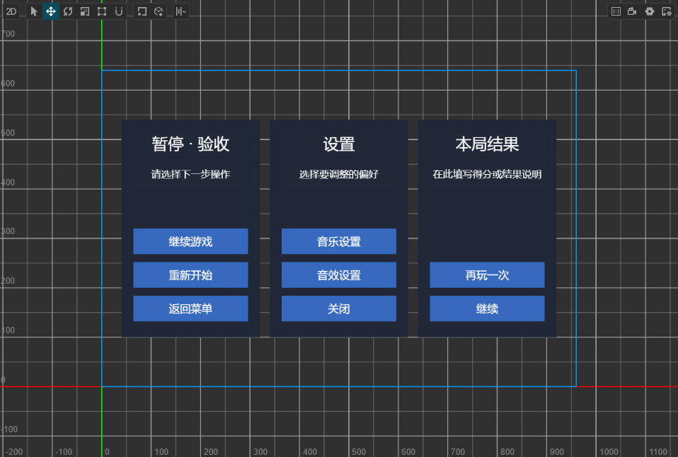
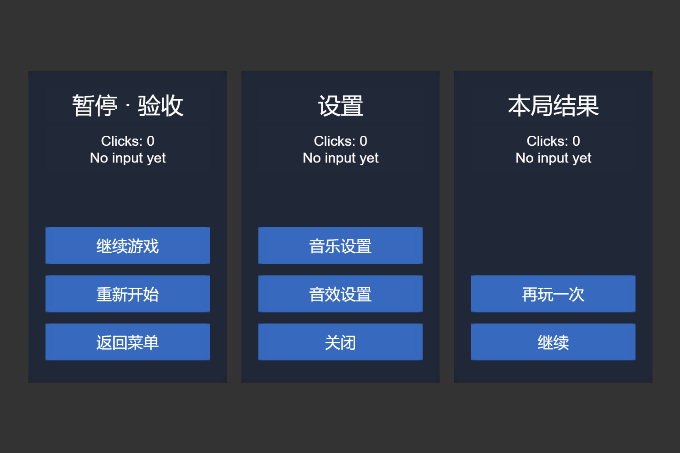

# 首版八项验收：真实点击与完整截图补验

日期：2026-09-30。Windows / Creator 3.8.8。接续[首轮验收矩阵](FIRST_RELEASE_ACCEPTANCE_2026-09-30.md)。前一轮源码与文档已提交、推送至 `main`，提交 `559dc5a`；本轮没有修改功能代码。

用户明确允许显示并真实点击 `temp/stage4-20260930/project-a`。只启动该隔离工程，不打开或修改 CouchArcade。安装包内 **78 个 JavaScript 文件**与当前工作区源码 SHA-256 全部一致；没有为截图修改场景布局、分辨率、脚本或按钮事件。

## 结果

完成八项矩阵中剩余的本轮真实点击和完整截图证据：7 个绑定按钮均触发正确动作；禁用按钮不触发；Scene 与 Game View 来源准确且截图均 `clipped=false`。三个面板在本样本中完整可见，标题、按钮文案和两行计数没有裁切、重叠或遮挡，文字可读。

**已知视觉问题仍存在：禁用的音效按钮与启用按钮同色，缺少禁用态外观区分。** 不能把功能禁用通过称为禁用外观通过。本轮仅补验和记录，没有修改模板样式。

后续修复：同日按用户要求为新生成模板增加灰底、浅灰文字，并另建场景完成保存重开和真实点击，见[禁用外观验证](UI_DISABLED_STYLE_2026-09-30.md)。本报告的原场景、截图和上述历史结论保持不变；修复不会自动迁移旧场景。

首版八项场景在文档明确的样本范围内已执行并留存证据；横竖屏/Canvas 的额外组合仍采用 [2026-09-28 视口实测](UI_VIEWPORT_2026-09-28.md)，并非本轮重新运行全部历史案例。阶段 4 的最终安装包、第三方/内容审查和交付说明尚未完成，不宣布整体发布就绪。

## 操作与真实输入

使用 computer-use 技能逐次观察、点击和重新截图。不调用 `EventHandler.emitEvents`、回调方法、DOM 点击或脚本模拟输入来代替鼠标。

先最大化 Creator 窗口，切换 Scene 观察器到 2D 并定位 Canvas；再通过正式 `run_project_preview(mode="gameView")` 启动预览。Game View 保持项目设计分辨率 **960×640**，仅将显示缩放由 100% 调至 **71%**，使完整画布进入可见区域。编辑器观察相机与显示缩放不改变作者场景内容。

初次窗口刷新出现截图 ID 失效、其他应用遮挡和检测到用户输入的提示；停止旧坐标操作，重新选择 Creator 并刷新状态后才继续。没有操作遮挡的应用，没有把失败动作计入验收。

| 顺序 | 实际鼠标点击 | 本次可见反馈 |
| --- | --- | --- |
| 1 | 设置 → 音效设置（未绑定） | 设置仍为 `Clicks: 0 / No input yet` |
| 2 | 暂停 → 继续游戏 | `Clicks: 1 / resume` |
| 3 | 暂停 → 重新开始 | `Clicks: 2 / restart` |
| 4 | 暂停 → 返回菜单 | `Clicks: 3 / quit` |
| 5 | 设置 → 音乐设置 | `Clicks: 1 / music` |
| 6 | 设置 → 关闭 | `Clicks: 2 / close` |
| 7 | 结果 → 再玩一次 | `Clicks: 1 / retry` |
| 8 | 结果 → 继续 | `Clicks: 2 / continue` |

Creator 本地日志在 10:51:20—10:51:49 记录对应 7 条 `UI_VISUAL_CLICK`；禁用音效无回调。脚本只显示计数/action，本轮不验证暂停、重开游戏、音频、奖励、关闭界面或导航的真实业务副作用。

## 来源明确的正式截图

由正式 `verify_ui` 输出 PNG，原样复制到文档目录，没有生成、拼接、额外裁剪或其他后期处理。

| 证据 | PNG 像素 | 来源 | 结构检查 | 裁剪 |
| --- | --- | --- | --- | --- |
| Scene 编辑态 | 958×646 | creator_scene_view | 25 节点，passed=true | false |
| Game View 禁用按钮点击后 | 680×453 | creator_game_view | not_checked / preview_mode | false |
| Game View 7 个绑定按钮点击后 | 680×453 | creator_game_view | not_checked / preview_mode | false |

`visualValidation` 仍为 `not_run`，视觉结论来自本轮人工式画面核对，不是扩展的自动视觉判定。预览结构明确不检查，不复用编辑态通过结果。首轮隐藏窗口/错误 ID 的明确失败证据继续有效。

## 持久化、验证与收尾

停止 Game View，恢复原 browser 预览模式，核对 running=false；切换 `AcceptanceBlank` 再重新打开 `AcceptanceUI`，原生作者场景 JSON 与首轮保存记录逐字一致，运行计数没有写回编辑态。全部 8 个测试资产文件及元数据的哈希保持。最后正常退出本轮启动的 Creator，工程、候选包和原始证据均保留。

`AcceptanceUI.scene` 的 UUID 为 `b5ea2f5f-a1cf-4714-add8-a544a1f1b50e`，最终 SHA-256 为 `90289ce1b24eaf3e1a0f4dbf9dcf17e40e73862e6adc80735b9c96dadc308701`。

本轮推送前重新运行完整测试 **1437/1437 通过**。此后只改验收文档/图片，不改功能代码；文档一致性、发布清单与包清单再次检查。图像目录只加入三个精确证据文件，不包含工程、缓存、日志或 AGENTS.md。

原始记录：`temp/stage4-20260930/visual-evidence.json`、`visual.js`、测试工程 `temp/logs/project.log`；不会提交原始工程和日志。截图哈希：

- Scene：`7645836e0a3fc217fae111d9f584a261b6455320ab333f924b56f465b001cc7e`
- 禁用按钮：`fb46f61a2d1c4adb73abfa91631fe0bf626e78982cfce6caddaa34afe30d7450`
- 最终计数：`1022188f71c198300ec6a9b1fc8c0027baa9b32ede017845f0f2e515cbc1eca2`

未验证触摸、外部浏览器、Simulator、真机、其他 Creator 版本、所有文案/字体/宽高比、业务回调副作用或弹窗输入拦截。下一项为阶段 4 的安装包内容、第三方来源和 MIT 声明审查，随后完善交付说明与最终本地安装包；不跳过首版交付直接扩展阶段 5。
