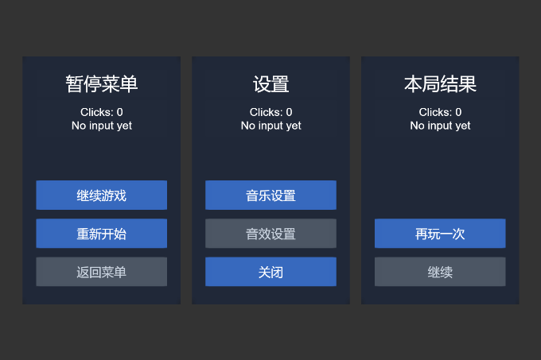

# UI 模板禁用按钮外观修复验证

日期：2026-09-30。Windows / Cocos Creator 3.8.8。接续[首版视觉补验](FIRST_RELEASE_VISUAL_ACCEPTANCE_2026-09-30.md)发现的禁用按钮同色问题。

## 修改范围

三个模板的未绑定按钮改为灰色背景 `#4B5563`、浅灰文字 `#CBD5E1`，分别保留按钮/文字输入的透明度。绑定按钮保留原配色；文案、尺寸、位置、`interactable` 和事件绑定逻辑不变。

仅修改生成器的初始静态颜色，不提供运行时状态过渡，不自动更新旧场景。手动追加事件并启用按钮时还需恢复 Sprite/Label 颜色。没有新增接口、资源、脚本模板或第三方依赖。

## 自动回归

- 新增 4 项测试：三个模板的全禁用/部分绑定、编译后颜色、文案与事件保持，以及自定义透明度和颜色对象独立性。既有全绑定用例补充自定义启用配色断言。
- 修改前新增测试均失败（4 项），修改后相关测试 **89/89** 通过。
- 完整 `npm test`：**1441/1441** 通过，0 失败、0 跳过。
- `npm run check`、`npm run release:check`、`git diff --check` 通过。

## Creator 持久化与真实点击

沿用用户已授权显示并点击的 `temp/stage4-20260930/project-a`，未操作 CouchArcade。仅将本次修改的 `lib/ui-templates.js` 同步至隔离扩展，保留旧文件备份；模块 SHA-256：`24d491d8c908aaf3ae81d82675892eb9c13492e50f5b68e6c3a4a7eef1824ee3`。旧候选压缩包没有重打包，也不能当作包含本次修复的交付包。

新建 `DisabledAppearance.scene`，不覆盖旧 `AcceptanceUI`。三个面板均 280×440，沿用自有白图和计数脚本；绑定 5 个 action，特意留下 3 个禁用 action。先保存、切换原场景、重开新场景，核对原生作者 JSON 逐字相同。随后读取实际 Sprite/Label 色值、Button 状态与事件数量：3 个禁用按钮均为指定灰色、0 事件；5 个启用按钮为原蓝底白字、各 1 个事件。

使用 computer-use 技能逐次观察、真实鼠标点击、刷新画面，不调用回调或模拟事件代替输入。Game View 设计分辨率 960×640、显示缩放 71%。

| 顺序 | 实际点击 | 可见反馈 |
| --- | --- | --- |
| 1 | 暂停 → 返回菜单（禁用） | 暂停计数保持 0 |
| 2 | 设置 → 音效设置（禁用） | 设置计数保持 0 |
| 3 | 结果 → 继续（禁用） | 结果计数保持 0 |
| 4 | 暂停 → 继续游戏 | `Clicks: 1 / resume` |
| 5 | 暂停 → 重新开始 | `Clicks: 2 / restart` |
| 6 | 设置 → 音乐设置 | `Clicks: 1 / music` |
| 7 | 设置 → 关闭 | `Clicks: 2 / close` |
| 8 | 结果 → 再玩一次 | `Clicks: 1 / retry` |

Creator 日志在 11:01:35—11:01:54 仅记录上述 5 条 `Disabled_*` 的 `UI_VISUAL_CLICK`。计数脚本不执行真实暂停、关闭、音频或重开游戏业务，不能把回调通过等同业务通过。

## 画面核对与截图

三个灰色按钮与蓝色启用按钮在本样本中区分清楚，浅灰文案可读；三个面板完整可见，没有文字重叠或裁切。以下均为正式 `verify_ui` 的原始 PNG，680×453、`creator_game_view`、`clipped=false`，无后期处理。

工具仍报告预览结构 `not_checked`、`visualValidation:not_run` 和 `runtimeSceneIdentity:not_verified`；上述视觉结论来自本轮实际画面核对与点击反馈，不冒充工具自动判定。

停止预览后恢复原 browser 模式，确认 running=false；新场景原生作者 JSON 和文件哈希未变，再次切换/重开后颜色与事件仍准确。原有 8 个资产及元数据的 SHA-256 始终保持。恢复原 `AcceptanceUI` 后正常退出本轮启动的隔离 Creator，服务端口关闭；没有保存运行计数或删除旧样本。

新场景 UUID：`2d9de900-2502-40aa-b3a7-fae9ebda729a`；SHA-256：`c6c8b3b46f11ee19aa3b313cc03da692e81e5fbc14f9da04caaec939a68f1799`。

截图 SHA-256：

- 禁用点击后：`5d337fb15a6a41ed426eea6dd49d06b0fdc7727d4d8263e5fc3e2e93799a4b98`
- 启用点击后：`1890beaf44bdb39bdcfce3af5fbf737b9da131a384e8cfd089dab0c21d4d83be`

原始证据：`temp/disabled-style/evidence.json`、`verify.js`、隔离工程 `temp/logs/project.log`；回归日志 `temp/disabled-style-full-tests.log`。这些本地测试工程/记录不提交，不随发布包分发。

未验证触摸、真机、其他 Creator 版本、所有自定义配色/素材、运行时切换状态或最终包安装。阶段 4 的发布包内容和来源审查仍待完成。
