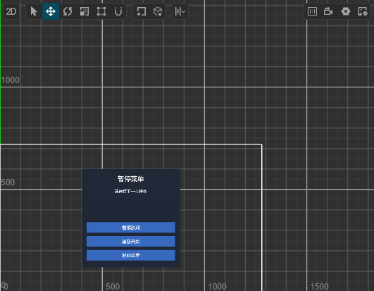
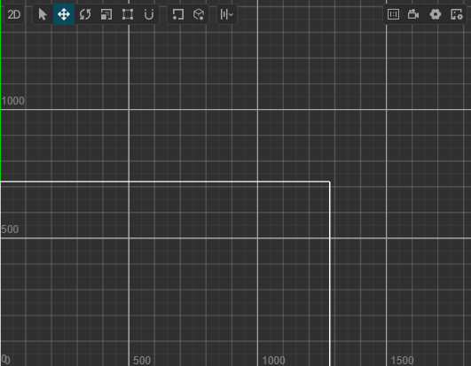
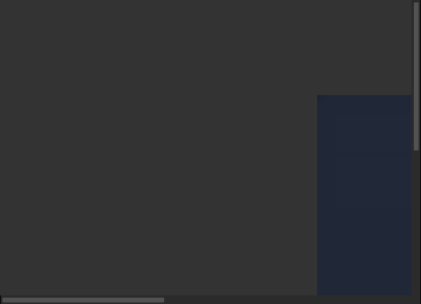

# FR-11 截图与组合验证记录

日期：2026-09-28。Windows、Node.js v24.15.0、Creator 3.8.8。core 43 / full 144；新增 `verify_ui`，四个既有编辑器/面板截图入口返回 PNG 与独立元数据。范围见 [UI_VERIFICATION.md](../UI_VERIFICATION.md)。

## 实现与自动测试

复用 FR-10 `validate_ui`、Electron capturePage 和现有 Game View 状态查询。为截图新增严格窗口/面板适配，不改动输入工具使用的旧定位路线；没有引入第三方代码或依赖。默认仅结构检查，指定截图才新增临时 PNG。结构报告、图片、客户端视觉结论分离，日志不保存 base64。

新增测试先得到缺失模块失败，再实现。新增 **34 项**，涵盖窗口不匹配/歧义/隐藏/最小化、准确面板与 webview 来源、裁剪祖先、缩放、路径与覆盖保护、空/非 PNG、目标漂移、运行状态、参数限制、截图失败的结构保留、general/preview 边界、场景变化后扣留图片、MCP 图片与 JSON 分离及日志脱离图片字节。

最终相关测试 **101/101 通过**；全量 **1432 项，1429 通过、3 失败、0 跳过**。失败仍为既有 Skills 基线：`UI skill v1 with a manifest can upgrade to v2`、`UI skill v1 without a manifest can upgrade to v2`、`legacy Codex UI v1 migrates with a backup and preserves the original file`。没有修改这些无关实现，也不宣称全量通过。日志在忽略的 `temp/fr11-focused.log` / `temp/fr11-full-tests.log`。

77 项语法检查、工具文档一致性、发布检查与差异空白检查通过。打包 dry-run 为 187 个文件，确认新增模块、契约、报告、三张证据图及 LICENSE 在包内，temp、.firecrawl 和 AGENTS.md 不在包内；没有对外发布。超时保护有实现但未在真实 Creator 制造挂死；页面缩放换算由单元测试覆盖，真实截图环境为 zoomFactor=1，不宣称所有系统 DPI/多屏布局已验证。

## 真实工程与操作边界

使用 `F:\AIWork\cocos-mcp-kit\temp\op055-project`，工程 UUID `e5055f21-1699-4530-8d40-5a7e12575caa`，MCP `127.0.0.1:27855`。用户本轮明确允许显示该隔离工程及切换 Scene/Game View。旧扩展已备份到 `temp/fr11-extension-backup`；仅正常退出/重启该测试实例，没有更新或操作 CouchArcade。

测试复用上轮的 `UiValidationChecks.scene`（场景 UUID `e51d0fb2-48fa-4cd5-a17b-570a6fd4a274`，9 个节点、三个 onAction 按钮事件）。正常与越界样例均保存、切出并重开，核对原生序列化后再执行检查。每次 `verify_ui` 前后对比原生场景 JSON 和 assets SHA-256，均无写入变化；截图文件只位于 temp。

重启曾进入 Creator 新建空白场景，正式切换工具拒绝未保存来源；确认隔离实例的空白内容不变且没有资产身份后，测试引导才通过原生 open-asset 恢复既有场景。没有放宽正式切换保护或保存空白场景覆盖文件。

computer-use 的一次目标窗口截图与预期编辑器不符，已停止依据该窗口坐标操作；没有点击其内容。最终证据来自扩展正式截图工具，核对 Creator 进程 main.html、可见窗口、面板/webview 来源后再读取原生 PNG，未将该异常的桌面图当成验收证据。

## 正常与异常样例

| 样例 | 实测结果 |
| --- | --- |
| general，默认不截图 | structure.passed=true，无 image block，无新截图 |
| general，请求 Scene | structure.passed=true；单个 MCP image block，来源 creator_scene_view |
| 面板移至 x=3000，保存重开后请求 Scene | 9 项越界，structure.passed=false，但仍提供正确的 Scene 图供独立复核 |
| 有意越界，排除 design_bounds | 剩余规则通过，排除项回显，不截图 |
| general，请求尚未运行的 Game View | MCP isError=true，completed=false，保留 structure.passed=true，零图片 |
| 标题无匹配、错误 windowId | 明确报错，无窗口回退、零图片 |
| `windowKind: simulator` | 明确不支持外部模拟器，零图片 |
| `../escape.png`、已存在的截图文件名 | 分别拒绝路径与覆盖，不产生替代图片 |
| 启动 Game View，再请求 game | PNG 来源 creator_game_view；结构 status=not_checked / reason=preview_mode，而不是假定通过 |
| preview 下请求 Scene 组合流程 | 拒绝编辑态流程，不回退到 Game View 图片 |
| 独立 capture_game / capture_preview / capture_editor | 均返回一张 PNG 及各自来源、时间、尺寸；编辑器全图与 Game View 可见裁剪区域相符 |
| 停止预览后再次请求 game | 再次明确失败，无旧截图/缓存报告复用 |

初版尝试在 preview 模式执行结构验证被 general 保护拒绝；最终实现据此明确区分模式，随后重新安装、重启并复测。没有为方便组合流程而放宽 FR-10 保护。最终停止预览、恢复 browser 模式并回到原 `UiVisualAcceptance.scene`；原场景 JSON 一致，**122 个原 assets 文件哈希全部保持**。没有新增或删除工程资产，仅留下测试截图及忽略的辅助日志。

## 图片证据与独立视觉观察

以下 PNG 为工具原始输出复制，未裁剪加工或生成替代图。

正常 Scene（531×413，18287 B，region.clipped=false）：可以看到暂停菜单与三个按钮位于设计框内；Scene 网格和观察工具条仍可见。这只是样例观察，不是通用美观/清晰度验收。

异常 Scene：结构报告定位 9 个越界节点，画面中原设计框内不再显示面板。这与独立观察一致，不由截图成功状态推导。

Game View（531×384，1824 B，region.clipped=true）：预览为 1280×720、100% 缩放，而可见面板更小，因此只见背景、滚动条与面板一角。**本图不具备完整 UI 视觉验收条件**；应调整预览显示后另行验收。它证明的是正确 Game View 来源和可见范围裁剪，而不是完整游戏画面或 UI 通过。

最终正常 Scene 组合报告 JSON 为 **2199 UTF-8 字节**，Game View 为 **1841 字节**（不含 MCP 外层及图片）；PNG 分别如上。base64 另占协议传输量，不将 JSON 大小宣称为总 Token 开销。原始调用与文件哈希保留于忽略的 `temp/fr11-evidence.json`。

## 未覆盖范围

未进行本轮真实按钮点击；上一轮点击验收有独立记录。不验证外部浏览器/Simulator、未知 Creator 版本/浮动面板、渲染内容截图（FR-25）、运行场景加载身份、所有字体字形、遮罩/遮挡或像素差异。延迟不等于渲染完成，场景哈希不是跨进程原子锁。视觉模型由客户端提供，扩展始终返回 `visualValidation: not_run`。阶段 4 仍需逐项执行完整首版验收，不能依据此报告宣称整体产品验收通过。
