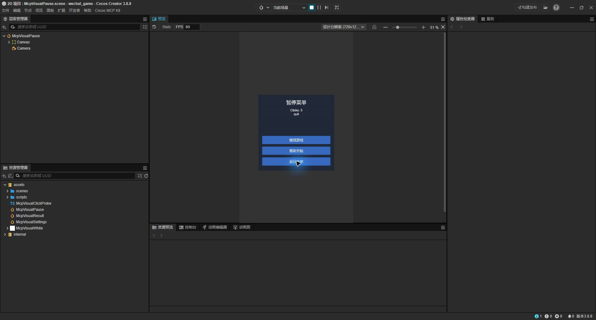
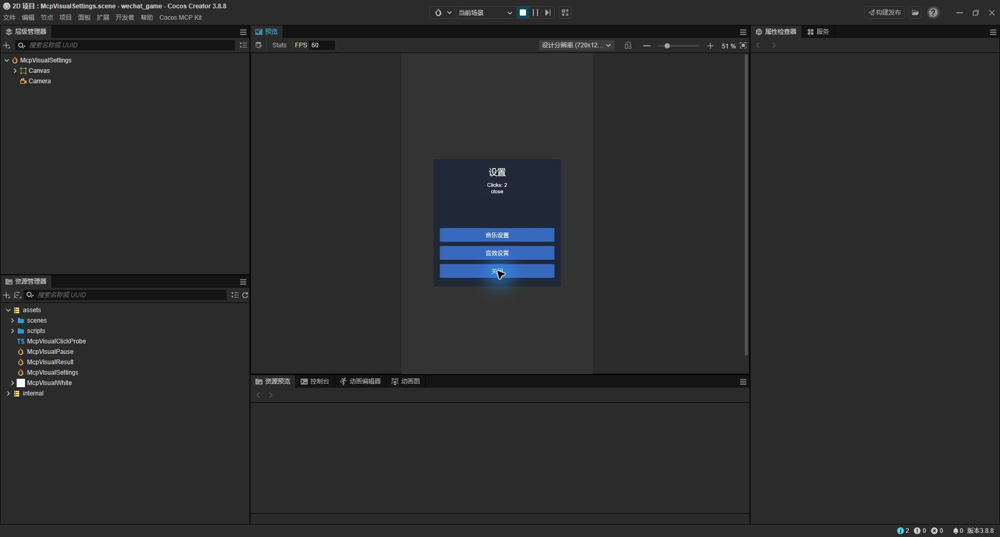
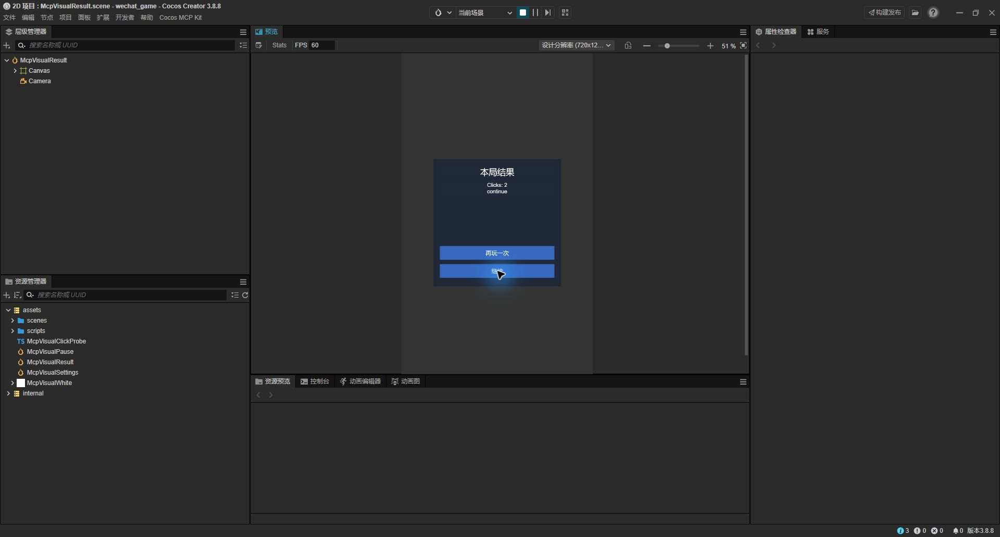

# UI 模板真实点击与视觉验收

日期：2026-09-28。Windows，Cocos Creator 3.8.8，用户打开的 `F:\AIWork\CouchArcade-main`（wechat_game）；设计分辨率 720×1280，Game View 缩放 51%。源码基线 `74cc6ac`，本轮未修改扩展功能代码。

## 保护与准备

- 新增项目级 `extensions/cocos-mcp-kit`，从本仓库复制运行源码及完整 LICENSE；未使用上游安装地址或受限材料。服务绑定 127.0.0.1:22917，项目身份核对通过，验收使用 full 配置。
- 初始 `Game.scene` 的 dirty=false，但原生序列化与磁盘不同，正式场景切换被拒绝。用户明确授权后，先备份场景与 meta 并逐字节核对，再通过正式工具保存；没有自动丢弃内容。
- 原场景备份目录：`F:\AIWork\cocos-mcp-kit\temp\couch-game-backup-2026-09-28T07-18-42-351Z`。备份不在游戏 assets 内、不提交仓库。
- Game.scene 保存前 SHA-256：`65a93768009c1db38e299abd1741e6a847c244fdde90fedf2c3a504bc0451869`；授权保存后：`a894b822b900cd6aea43f5e0fd784258cd59046ac3b9b2b2d6a45fd016a05cf3`。其余 116 个原资源文件保持原哈希；不能将本轮表述为所有原文件均未改变。
- 新增自有白色图片 `McpVisualWhite.png`、临时计数脚本 `McpVisualClickProbe.ts` 及三个独立场景（均含 meta）。新图片默认导入为 Texture，随后通过 asset-db 将该新图片的导入类型设为 SpriteFrame，查询实际子 UUID 后构建；未改其他图片。
- 三个模板使用默认中文标题/按钮、默认配色和 480×480 尺寸，正式调用 `get_ui_template` → `build_ui` → 显式保存 → 重开 → Game View。计数脚本仅更新 Message 文本并记录本次 action，不实现暂停、音乐设置、关闭、奖励或导航业务。

## 真实鼠标点击

使用 computer-use 技能：从当前窗口截图定位可见按钮，逐次鼠标点击，每次重新截图检查。没有调用 `EventHandler.emitEvents`、`onAction` 或脚本模拟点击。

| 场景 | 按钮点击顺序 | 可见结果 |
| --- | --- | --- |
| McpVisualPause | 继续游戏 → 重新开始 → 返回菜单 | `Clicks: 1 / resume` → `2 / restart` → `3 / quit` |
| McpVisualSettings | 未绑定的音效设置 → 音乐设置 → 关闭 | 保持 `Clicks: 0 / No input yet` → `1 / music` → `2 / close` |
| McpVisualResult | 再玩一次 → 继续 | `Clicks: 1 / retry` → `2 / continue` |

7 个绑定按钮全部触发正确 action，禁用按钮不触发。测试中的“关闭”“返回菜单”只验证事件参数，并不会实际关闭面板或导航。

## 截图与视觉结论

三个面板均完整可见；本样本的中文标题、按钮文案与两行计数没有裁切、相互重叠或遮挡，文字对比度可读，按钮位于面板内。Game View 原先为 100% 且竖屏内容超出工作区，调整编辑器预览缩放后验收；没有改变项目设计分辨率或场景布局来规避问题。

**已知视觉问题：禁用的“音效设置”仍与其他按钮同为蓝色，缺少禁用态视觉区分。** 功能禁用通过，不等于禁用外观通过。本轮是验收任务，只记录问题，未擅自修改模板样式。

截图为实际 Creator 窗口原始捕获，不是结构渲染、拼接或生成图。视觉判断来自对这些窗口画面的检查，不宣称由扩展自动完成视觉判断。

## 持久化与收尾

| 场景 | 资产 UUID | 保存后的 SHA-256 |
| --- | --- | --- |
| McpVisualPause | `7d5db5bd-cd22-403b-a8e0-92f2a6e5de7a` | `b2835639855f34ea9557a5beb98817bb71a7ac94277a344f4ef743285427a72d` |
| McpVisualSettings | `ea1e47a3-0cda-4f02-ae2e-404d5f31b065` | `878a1abc59cb920222a7cedce82836f715c8292a37962455efdf091f2cb536ac` |
| McpVisualResult | `82334174-ceb9-47fc-81f4-4342c9e5fe3f` | `dceb20789767910f818e66df0e1efa7c182db8609b1248cdfb81413a19a6bf98` |

停止运行后再次逐一重开三个样本，原生序列化与构建保存时逐字一致（含节点/组件身份及图片、脚本、事件引用），源文件哈希不变；运行计数没有写回编辑态。最后打开 Game.scene，序列化与授权保存后的记录相同、dirty=false；原预览 browser 模式已恢复，running=false。项目扩展、测试资源、配置和备份均保留，没有删除用户数据。

本地原始调用及哈希记录：`temp/couch-visual-evidence.json`；验收辅助脚本：`temp/couch-visual.js`、`temp/couch-rpc.js`、`temp/UiVisualClickProbe.ts`。均不提交，setup/build 不应盲目重跑。

## 边界

本轮没有重跑单元测试（未改功能代码）；不改变既有全量测试中 3 项 Skills 失败的结论。完整进程重启证据沿用前一轮隔离工程，不宣称本次重启 CouchArcade。

未验触摸、浏览器、真机、其他 Creator 版本、所有宽高比/文案/字体/背景、真实游戏回调副作用、弹窗输入拦截及业务状态切换。阶段 2 的构建/保存/重开/点击闭环在以上限定样本通过，不等于完整产品视觉或真机验收通过；阶段 3 的知识、结构验证和截图工具工作仍待实施。
